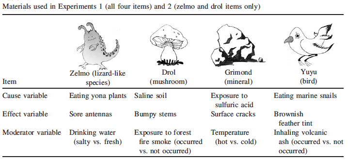
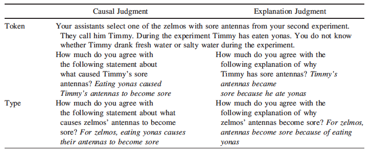
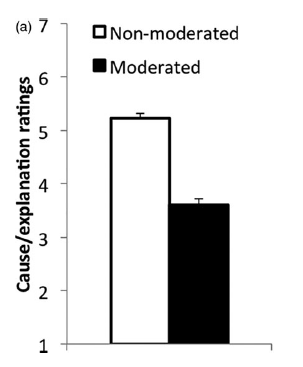

<!-- Replication reports should all use this template to standardize reporting across projects.  These reports will be public supplementary materials that accompany the summary report(s) of the aggregate results. -->

## Introduction

Vasilyeva, Blanchard, & Lombrozo (2018, Cognitive Science) investigated people's evaluations of causal relationships based on *stability* - that is, whether a causal relationship holds across possible moderating variables. Across three experiments, Vasilyeva et al. demonstrated that adults were more likely to endorse *stable* causal claims over *unstable* causal claims (i.e. that don't hold across a potential moderator). Particularly in Experiment 1 (the target of this replication), adults not endorsed *stable* causal claims over *unstable* causal claims when presented with covariation data from a hypothetical science study.

One key interest of mine is childrens' developing causal reasoning - how do children reason about causal systems and explanations? A key part of this research program will also be characterizing the adult state and asking how adults reason about the same phenomena and questions. Replicating an experiment from this paper would help me better understand the design and analyses associated with asking adults about their judgments centered around important aspects of a causal relationship. This work could extend into further replications (i.e. of the other experiments in this paper) and/or further questions (developmental or otherwise) that would be very relevant to my research interests.

I plan on replicating the result from Experiment 1 - that adults were more likely to endorse a causal relationship when the relationship was non-moderated vs. moderated. I chose this result because they manipulated many possible factors that might play into adults intuitions about causal relationships (i.e. varying the DV questions), and it was the first result that laid out the phenomenon that later experiments could build on top of. Its analysis was a 2 x 2 x 2 mixed ANOVA, and a separate 2 x 2 mixed ANOVA for a separate DV (counterfactual ratings). 

### Procedure and Anticipated Challenges

The study will be run on Prolific with adults in the United States. The task is simple - participants will read blocks of text describing a scientists' investigation on a novel alien population, then be given covariation data from the scientists' study. There are no other materials other than the text from the questions and scenario. I will obtain the exact stimuli (scenario and question wording) from the researchers, build a Qualtrics survey for the task, and analyze the data using R. For this, I will need funds to run participants on Prolific. One key concern about this experiment in particular is the exclusion rate. I will keep an eye on this exclusion rate and discuss with the TAs and Mike to see if it constitutes a bigger issue for carrying out the project, but also conduct exploratory analyses with additional check questions to see if different exclusion criteria changes the results in a meaningful way.

There appears to an OSF link on the paper, but it is broken. The data file for this experiment on OSF appears to be empty - there are no open materials from this experiment online. I will have to contact the researchers to request more information about administration of the task, clarification on the exact study design, the stimuli and question wording and coding (beyond what is written in the paper, which spells out most of the wording already), and clarification on their analyses.

### Links

Project repository (on Github): https://github.com/psych251/vasilyeva2018.git

Original paper (as hosted in your repo): https://github.com/psych251/vasilyeva2018/blob/main/original_paper/Vasilyeva_Blanchard_Lombrozo_2018.pdf or https://onlinelibrary.wiley.com/doi/10.1111/cogs.12605  

## Methods

### Power Analysis

With a power of .80 and replicating the original effect size of a partial eta squared of .478, we require 6 participants in each of the four conditions  (12 in moderated/non-moderated).

### Planned Sample

Participants will be limited to Prolific users in the United States, and failure on any of the comprehension questions in the survey will result in exclusion from analysis. Otherwise, there are no other preselection rules or other restrictions on the sample.

### Materials, Design, and Procedure

From the article: 

"Participants first completed a short training to ensure that they could interpret covariation tables and were then placed in the role of a scientist (zoologist, botanist, geologist, or ornithologist) studying several natural kinds on a fictional planet. Table 1 shows the four kinds — zelmos, drols, grimonds, and yuyus — each associated with a triad of variables (putative cause, effect, and moderator). We illustrate the procedure with zelmos, but the structure was matched across cases. 

The scientist was described as investigating the hypothesis that eating yona plants is causally related to developing sore antennas. Participants were told that to test the hypothesis, the scientist performed an experiment, selecting a random sample of 200 zelmos and randomly assigning them to two equal groups that ate a diet either containing or not containing yonas. Participants saw the results of the experiment in the form of a 2 x 2 covariation table cross-classifying zelmos based on whether they ate yonas or not, and whether they developed sore antennas or not (see Fig. 1a). The numbers in the table were selected to provide support for a relationship with causal strength equal to a $\Delta$P of about .4 (range 0.39–0.42).

The scientist then decided to conduct a second experiment with a new, larger sample of 400 zelmos, again randomly assigning zelmos to one of the two diets. But this time the scientist discovered after the experiment that due to a miscommunication between research assistants, half of the zelmos were given salty water, and the other half were given fresh water. The two values of this potentially moderating variable were always said to occur normally on the planet; for example, in the wild, zelmos drink either fresh or salty water, depending on what’s available. (This moderating variable played the role of a “background circumstance” relative to which the cause-effect relationship (e.g., eating yonas --> sore antennas was stable or unstable.) Luckily for the scientist, the moderator and cause variables varied orthogonally. Participants were told that “to see whether drinking salty water made a difference to the effects of yonas on sore antennas, you decide to look at the results of the experiment within each of these two groups.” This time participants were presented with the data split into two tables, one for the salty water subgroup, and one for the fresh water subgroup, each table cross-classifying zelmos in terms of diet and antenna soreness (see Fig. 1). 

Depending on condition, the split tables indicated a relationship that was either moderated or not moderated. In the moderated cases (illustrated in Fig. 1c), in one subgroup (salty water) the relationship between eating yonas and sore antennas was very strong ($\Delta$P = .81–0.86), while in the other subgroup (fresh water), the relationship disappeared ($\Delta$P = .00–0.01). In the non-moderated cases (Fig. 1b), each of the split tables corresponded to relationships with a $\Delta$P comparable to the ~0.40 from the original, unsplit table. Importantly, the average strength of the relationship across the two split tables was the same in the moderated and non-moderated conditions (or differed by no more than 0.05 $\Delta$P units, always in the direction working against our hypothesis3), and equaled the strength of relationship in the first table that participants saw for each item (within .03 $\Delta$P units). The split tables were accompanied by a note for moderated [non-moderated] conditions: “The tables reveal that the data pattern looks very different [similar] for zelmos who drank salty water during the experiment and for zelmos who drank fresh water during the experiment. Please compare the two tables to see how different [similar] the patterns are.” 

Once all three covariation tables had been presented, participants evaluated either claims about causal relationships or explanations (Table 2). Each claim was presented either at the type or token level. All claims were unqualified; that is, they stated a relationship between eating yonas and sore antennas without mentioning the kind of water the zelmo(s) in question drank. In addition, participants evaluated one counterfactual statement for each scenario; for example, after learning about a group of zelmos who were fed yonas, drank salty water, and developed sore antennas, participants rated their agreement with the statement that “had these zelmos eaten yonas but not drunk salty water, their antennas would still have become sore.” This statement was included to verify that participants differed across the moderated and non-moderated conditions in the role they attributed to the moderator. 

At the end of the experiment, participants answered two multiple-choice comprehension check questions about each scenario they had read (e.g., “According to what you read, as a scientist on planet Zorg you were interested in evaluating the following hypothesis about zelmos: a. eating yona plants produces antenna soreness; b. eating drol mushrooms produces antenna soreness; c. eating mushrooms with stem bumps produces spotted antennas; d. antenna soreness makes zelmos eat yonas”). Participants who answered either question incorrectly were excluded from further analyses. 

Across items, each participant saw two moderated cases and two non-moderated cases, presented in random order. Thus, Experiment 1 had a 2 moderator (moderated vs. nonmoderated relationship) x 2 judgment (causal vs. explanatory) x 2 target (type vs. token) mixed design, with moderator manipulated within-subjects. The dependent variables were agreement with causal or explanatory claims, and agreement with counterfactual claims, measured on a 1 (strongly disagree) to 7 (strongly agree) scale."






Link to the Experiment (this is currently the link to Pilot B but will likely duplicate this again for the final data collection): https://stanforduniversity.qualtrics.com/jfe/form/SV_8JkAjgU5meJHcSq

### Analysis Plan

The key analysis of interest is the 2 (moderator vs. non-moderator) x 2 (causal vs. explanatory) x 2 (type vs. token) mixed ANOVA reported in section 2.2.1 of the paper, Experiment 1. It is a mixed ANVOA on the causal and explanatory ratings, where they found a main effect of moderator on participant's judgments, with no other main effects of interactions. A successful replication will replicate the main effect of moderator (ideally with an $\eta^{2}_{p}$ of at least .4, similar to their effect size, but this will be examined upon analysis of the results), with no other main effects of interactions. This is the key analysis of interest as it the very first piece evidence of the phenomenon that adults consider causal stability in the strength of the causal claims.

I will first import the data and relevant libraries. Then I will clean the data - omitting irrelevant columns to the analysis and excluding participants based on the exclusion criteria (in this case, participant's who answered at least one check question incorrectly). Then I will ready the data for analysis (e.g. changing from wide to long format, and other necessary steps that will be taken upon retrieval of the data), perform the ANOVA using the "aov" function in R, calculate effect sizes, and plot the data. I will then determine whether the result constitutes a successful replication.

### Differences from Original Study

I hope to perform as faithful of a replication as possible - which includes utilizing the same design, stimuli, wording, and analysis pipeline.

If the researchers are unable to provide any of the materials, I may have to deviate from the exact stimuli/wording used in the original experiment. I may also have to compute the statistical tests in a different computing environment to what the researchers used in their study. Additionally, the population tested in the original experiment were participants on Amazon Mechanical Turk, whereas I will be testing participants on Prolific. I do not expect these differences to influence my ability to replicate the original results.

I also plan on producing additional plots (e.g. pirate plots) to investigate the full distribution of the data across the various independent variables.

<!-- ### Methods Addendum (Post Data Collection) -->

<!-- You can comment this section out prior to final report with data collection. -->

<!-- #### Actual Sample -->
<!--   Sample size, demographics, data exclusions based on rules spelled out in analysis plan -->

<!-- #### Differences from pre-data collection methods plan -->
<!--   Any differences from what was described as the original plan, or “none”. -->

## Results

### Data preparation

Data preparation following the analysis plan:

This data preparation process follows the analysis plan. We will first load in the data from qualtrics using the package "qualtRics", then clean the data by removing irrelevant rows/columns and excluding participants who incorrectly answered at least one check question. Then will will transform the dataframe in a format suitable for statistical tests (e.g. changing from wide to long format):
	
```{r data cleaning, include=T}
###Data Preparation

####Load Relevant Libraries and Functions

library(tidyverse)
library(plotrix) #and others if necessary
library(qualtRics)
library(ez)
library(yarrr)
library(DescTools)

####Import data

data <- fetch_survey(surveyID = "SV_bQ6I1kuS75Z5Jvo", force_request = T, include_display_order = FALSE, label = FALSE, convert = FALSE)

#### Data exclusion / filtering

data <- data %>% 
  mutate(id = row_number()) %>% 
  select(id, everything()) %>% 
  filter(Consent == 2) %>% #consenting
  filter(Mch.z1 == 1,
         Mch.z2 == 1,
         Mch.d1 == 1,
         Mch.d2 == 1,
         Mch.g1 == 1,
         Mch.g2 == 1,
         Mch.y1 == 1,
         Mch.y2 == 1) %>% #check questions
  subset(select = -c(2:19)) %>% 
  select(-starts_with(c("Mch", #getting rid of irrelevant columns, including check questions
                        "Comm",
                        "Age", 
                        "Gender",
                        "prolific-id",
                        "PROLIFIC_PID",
                        "tableorder",
                        "cov"))) %>% 
  pivot_longer(!c(id, task, moderator), names_to = "question_type", values_to = "rating") %>% #turn table into longer
  mutate(presence_of_moderator = case_when(moderator == "drolyuyu" & grepl("d3", question_type) ~ "present", #create column indicating whether it was moderated or not
         moderator == "drolyuyu" & grepl("d4", question_type) ~ "present",
         moderator == "drolyuyu" & grepl("y3", question_type) ~ "present",
         moderator == "drolyuyu" & grepl("y4", question_type) ~ "present",
         moderator == "zelmogrimond" & grepl("z3", question_type) ~ "present",
         moderator == "zelmogrimond" & grepl("z4", question_type) ~ "present",
         moderator == "zelmogrimond" & grepl("Z3", question_type) ~ "present",
         moderator == "zelmogrimond" & grepl("Z4", question_type) ~ "present",
         moderator == "zelmogrimond" & grepl("g3", question_type) ~ "present",
         moderator == "zelmogrimond" & grepl("g4", question_type) ~ "present",
         TRUE ~ "absent")) %>% 
  mutate("causalexplanatoryCF" = case_when(grepl("CaTy", question_type) ~ "causal", #change column names
                                     grepl("ExTy", question_type) ~ "explanatory",
                                     grepl("CaTo", question_type) ~ "causal",
                                     grepl("ExTo", question_type) ~ "explanatory",
                                     grepl("Ty.CF", question_type) ~ "counterfactual",
                                     grepl("To.CF", question_type) ~ "counterfactual")) %>% 
  mutate("typetoken" = case_when(grepl("CaTy", question_type) ~ "type", #change column names
                                     grepl("ExTy", question_type) ~ "type",
                                     grepl("CaTo", question_type) ~ "token",
                                     grepl("ExTo", question_type) ~ "token",
                                     grepl("Ty.CF", question_type) ~ "type",
                                     grepl("To.CF", question_type) ~ "token")) %>% 
  filter(!is.na(rating)) %>% 
  select(-c(moderator, task, question_type)) #get rid of last remaining unnecessary columns
```

### Confirmatory analysis

The first goal is to perform the main 2x2x2 mixed ANOVA, which is laid out in the analysis plan and outlined as the analysis of interest. We will simply perform the ANOVA, and plot it using ggplot (using the same method as the paper just for the sake of comparison, but further plots are shown below):

First, we will get rid of the counterfactual data:

```{r main data cleaning}
#perform ANOVA on causal/explanatory ratings

dataconfirmatory <- data %>%
  filter(grepl("counterfactual", causalexplanatoryCF) == FALSE)
```

Now we perform the ANOVA:

```{r main anova}
aov1 <- aov(rating ~ (presence_of_moderator*causalexplanatoryCF*typetoken) + Error(id/(presence_of_moderator)) + (causalexplanatoryCF*typetoken), data = dataconfirmatory)

summary(aov1)
```

and the effect size:

```{r main eta sq}

etasq1 <- EtaSq(aov1, type = 1, anova = TRUE)

etasq1 #full table

etasq1[1,2] #effect size for the presence of moderator

```

Now we plot it similarly to the paper, using a bar plot and only showing the effect for the presence of the moderator:

```{r confirmatory/main ANOVA, fig.width = 5}
#plot using ggplot, using same method as paper just for comparison

confirmatoryplot <- dataconfirmatory %>% 
  group_by(presence_of_moderator) %>% 
  summarize(Mean = mean(as.numeric(rating), na.rm = TRUE), SEM = std.error(rating, na.rm = TRUE))

ggplot(confirmatoryplot, aes(x = presence_of_moderator, y = Mean, fill = presence_of_moderator)) +
  geom_bar(position = "dodge", stat = "identity", width = .6) +
  geom_errorbar(aes(ymin = Mean - SEM, ymax = Mean + SEM), position = position_dodge(.9), width = .25) +
  theme_classic() +
  ylab("Cause/Explanation Ratings") +
  xlab("Presence of Moderator")+
  scale_x_discrete(labels = c("Non-Moderated", "Moderated")) +
  scale_fill_manual(guide = NULL, name = "Presence of Moderator", labels = c("Non-moderated", "Moderated"), values = c("gray", "grey20")) +
  theme(legend.position = "top")

```

We can now visually compare the plot generated from the replication to the plot in the original paper:



For a more comprehensive look at the data, we can create pirate plots for each independent variable, and view its distribution. Consistent with the original paper, we should see differences in the presence of moderator, but not in the causal/explanatory judgments, or the type/token judgments:

```{r main pirate plots}

#as per suggestion: pirate plot of all condition differences

pirateplot(formula = rating ~ presence_of_moderator,
           data = dataconfirmatory,
           theme = 3,
           xlab = "Presence of Moderator",
           ylab = "Cause/Explanation Ratings",
           point.o = 1,
           gl.lty = 1,
           width.min = 1,
           point.pch = 16,
           inf.f.o = .4,
           yaxt = "n",
           xaxt = "n")
axis(2, at = seq(from = 0, to = 7, by = 1), las = 2)
axis(1, at = c(1,2), labels = c("Non-Moderated", "Moderated"), lwd = 0)

pirateplot(formula = rating ~ causalexplanatoryCF,
           data = dataconfirmatory,
           theme = 3,
           xlab = "Causal vs. Explanatory Questions",
           ylab = "Endorsement Ratings",
           point.o = 1,
           gl.lty = 1,
           width.min = 1,
           point.pch = 16,
           inf.f.o = .4,
           yaxt = "n",
           xaxt = "n")
axis(2, at = seq(from = 0, to = 7, by = 1), las = 2)
axis(1, at = c(1,2), labels = c("Causal", "Explanatory"), lwd = 0)

pirateplot(formula = rating ~ typetoken,
           data = dataconfirmatory,
           theme = 3,
           xlab = "Type vs. Token Questions",
           ylab = "Cause/Explanation Ratings",
           point.o = 1,
           gl.lty = 1,
           width.min = 1,
           point.pch = 16,
           inf.f.o = .4,
           yaxt = "n",
           xaxt = "n")
axis(2, at = seq(from = 0, to = 7, by = 1), las = 2)
axis(1, at = c(1,2), labels = c("Token", "Type"), lwd = 0)

```
Now we will perform the analysis performed in section 2.2.2 of the paper - not the key analysis of interest but relevant to the experiment. This is a 2 (moderator vs. non-moderator) x 2 (type, token) mixed ANOVA on participants' counterfactual ratings. They found a main effect of moderator but no effect of target and no interaction. We will now perform that analysis and plot it using ggplot:

First, get rid of the non-counterfactual data:

```{r counterfactual data cleaning}
#perform ANOVA on counterfactual ratings

datacounterfactual <- data %>%
  filter(grepl("counterfactual", causalexplanatoryCF))
```

Now we perform the ANOVA:

```{r counterfactual anova}
aov2 <- aov(rating ~ (presence_of_moderator*typetoken) + Error(id/(presence_of_moderator)) + (typetoken), data = datacounterfactual)

summary(aov2)
```

and compute the effect size:

```{r counterfactual eta sq}

etasq2 <- EtaSq(aov2, type = 1, anova = TRUE)

etasq2

etasq2[1,2]

```

Now we can plot it using the aesthetics from the paper (though they did not actually report this plot, putting it here for the sake of symmetry with the previous section):

```{r counterfactual ANOVA, fig.width = 5}
counterfactualplot <- datacounterfactual %>% 
  group_by(presence_of_moderator) %>% 
  summarize(Mean = mean(as.numeric(rating), na.rm = TRUE), SEM = std.error(rating, na.rm = TRUE))

ggplot(counterfactualplot, aes(x = presence_of_moderator, y = Mean, fill = presence_of_moderator)) +
  geom_bar(position = "dodge", stat = "identity", width = .6) +
  geom_errorbar(aes(ymin = Mean - SEM, ymax = Mean + SEM), position = position_dodge(.9), width = .25) +
  theme_classic() + 
  ylab("Cause/Explanation Ratings") +
  xlab("Presence of Moderator")+
  scale_x_discrete(labels = c("Non-Moderated", "Moderated")) +
  scale_fill_manual(guide = NULL, name = "Presence of Moderator", labels = c("Non-moderated", "Moderated"), values = c("gray", "grey20")) +
  theme(legend.position = "top")

```

Likewise with the previous section, we can generate pirate plots showing the presence of moderator, and type/token. Consistent with the paper, a replication would find a difference in the presence of moderator, but not in the type/token judgments.

```{r counterfactual pirate plot}
pirateplot(formula = rating ~ presence_of_moderator,
           data = datacounterfactual,
           theme = 3,
           xlab = "Presence of Moderator",
           ylab = "Cause/Explanation Ratings",
           point.o = 1,
           gl.lty = 1,
           width.min = 1,
           point.pch = 16,
           inf.f.o = .4,
           yaxt = "n",
           xaxt = "n")
axis(2, at = seq(from = 0, to = 7, by = 1), las = 2)
axis(1, at = c(1,2), labels = c("Non-Moderated", "Moderated"), lwd = 0)

pirateplot(formula = rating ~ typetoken,
           data = datacounterfactual,
           theme = 3,
           xlab = "Presence of Moderator",
           ylab = "Cause/Explanation Ratings",
           point.o = 1,
           gl.lty = 1,
           width.min = 1,
           point.pch = 16,
           inf.f.o = .4,
           yaxt = "n",
           xaxt = "n")
axis(2, at = seq(from = 0, to = 7, by = 1), las = 2)
axis(1, at = c(1,2), labels = c("Token", "Type"), lwd = 0)
```
### Exploratory analyses

```{r}
#in this section going to look for effect of check questions, and the ones that I implemented
```

Any follow-up analyses desired (not required).  

## Discussion

### Summary of Replication Attempt

Open the discussion section with a paragraph summarizing the primary result from the confirmatory analysis and the assessment of whether it replicated, partially replicated, or failed to replicate the original result.  

### Commentary

Add open-ended commentary (if any) reflecting (a) insights from follow-up exploratory analysis, (b) assessment of the meaning of the replication (or not) - e.g., for a failure to replicate, are the differences between original and present study ones that definitely, plausibly, or are unlikely to have been moderators of the result, and (c) discussion of any objections or challenges raised by the current and original authors about the replication attempt.  None of these need to be long.
